# 2.1	进入函数调用图功能
点击call graph 按钮进入 call graph模块，效果如图1-1所示：

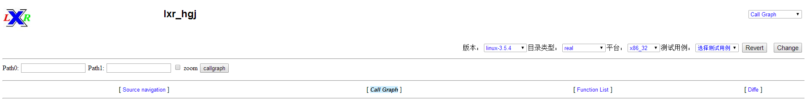

图1-1 call graph 模块首页

## 2.2	设置函数调用图功能参数
这时在系统右侧的选项栏中，用户可以选择分析平台分析的系统参数，分别是系统版本、目录类型、系统位数。本次说明中我们以系统版本Linux-3.5.4，真实目录real，64位系统x86_64为例，如图1-2所示：

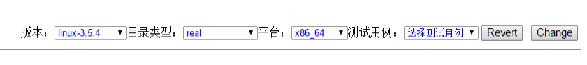

图1-2 call graph 系统参数选项栏

## 2.3	
在系统左侧的文本框中，用户可以选择本次分析的目录范围，用符号*来表示全部目录。本次说明中我们以全部目录范围*为例，如图1-3所示：

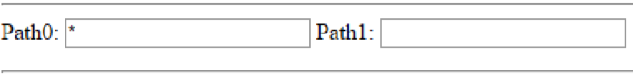

图1-3 call graph 目录范围输入栏

## 2.4	
在选择好所要分析的参数后，点击目录范围右侧的callgraph按钮 ，即可生成Linux3.5.4在全目录范围内的调用关系图，效果如图1-4所示：
 
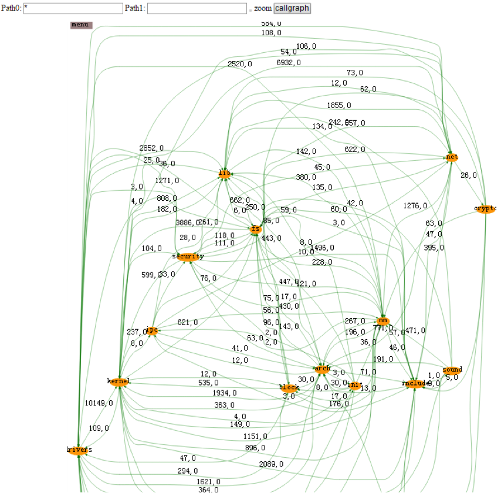

图1-4 call graph 调用关系效果图

此时，调用图中黄色背景黑色字体的即为Linux系统中的文件目录（模块）名称，模块与模块之间的连线代表模块之间存在调用关系，调用关系线上面的数字代表调用次数，其中逗号之前代表静态调用次数，逗号之后代表动态调用次数。
## 2.5	

在调用关系图的左上方有菜单按钮 ，点击菜单按钮会出现下拉框，点击下拉框上的每一个选项，就会在调用关系图中忽略所选类别的调用关系线，由于当前级别的模块间调用关系都是同一种，演示效果不明显，因此会在后续的介绍中做具体演示。下拉框内容如图1-5所示：

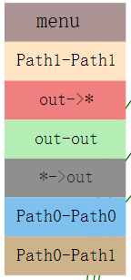

图1-5 菜单下拉栏效果图

## 2.6	

点击模块名称，以fs为例，会弹出下拉框，如图1-6所示：

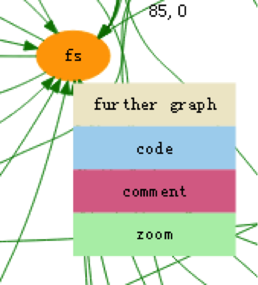

图1-6 节点下拉栏效果图

在下拉框选项中，further graph表示进入该模块下一层级的调用关系图，code表示查看代码，comment表示添加注释，zoom表示进入该模块内部且只展示模块内部的调用关系图。
## 2.7	
点击模块之间的调用关系线，以fs与mm之间的调用关系线为例，会弹出下拉框，如图1-7所示：

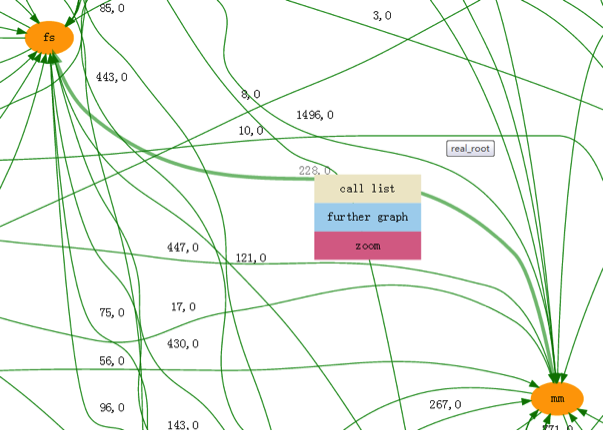

图1-7 调用关系线下拉栏效果图

在下拉选项中，call list 表示这两个模块间所有调用关系信息并以列表的形式表现，further graph 同理表示进入这两个模块间的下一层级调用关系图，zoom 同理表示进入这两个模块的下一层级调用关系图且只展示内部调用关系。

## 2.8	

点击call list按钮效果，如图1-8所示：

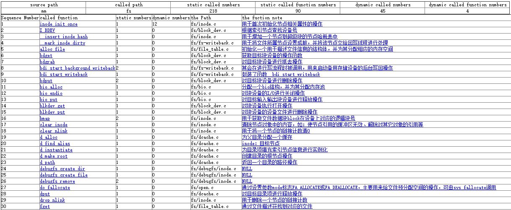

图1-8 call list 列表效果图

表头分别表示source path 源路径（被调用路径），called path 调用路径，static called numbers 静态调用次数，static called function numbers 静态调用函数数量。
列表分别表示called function 被调用的函数名称，static numbers 被调用次数，the Path 函数所在文件路径。
下方列表截图，如图1-9所示：
Part I

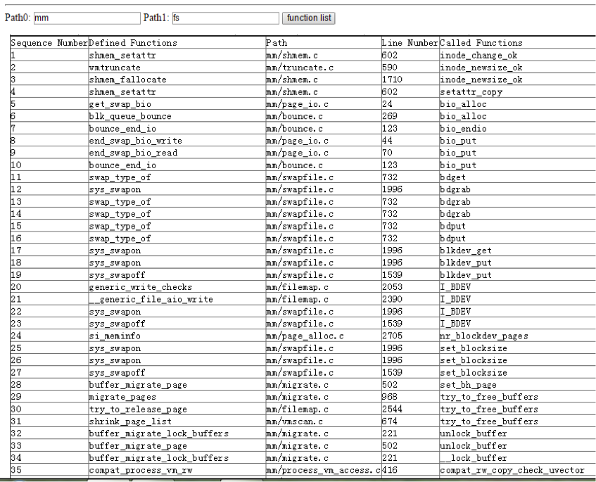

图1-9 call list 列表截图（部分）

列表分别表示Defined Functions 申请调用的函数，Path 函数所在文件的路径，Line Number 函数所在文件内的行号，Called Functions 被调用的函数。

Part II

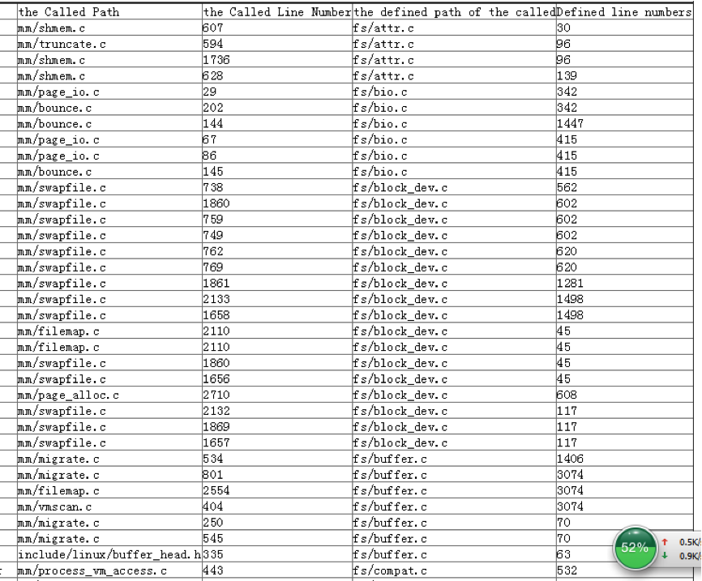

图1-10 call list 列表截图（部分）

列表分别表示the Called Path 被调用函数所在文件路径，the Called Line Number 执行调用函数的代码所在文件的行号，the defined path of the called 被调用函数所在文件路径，Defined line numbers 被调用函数所在文件行数。
## 2.9	

在fs模块点击further graph，进入下一层级的调用关系图，如图1-11所示：

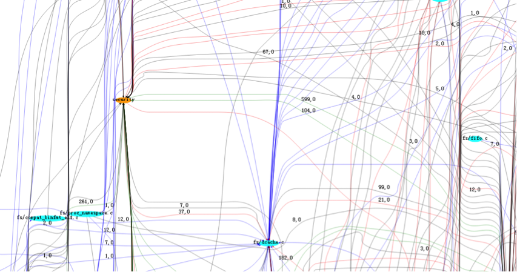

图1-11 further graph 调用关系图

其中，蓝色背景黑色字体的表示文件级别路径，黄色背景黑色字体的表示模块级别路径（存在模块级别路径，说明该模块内部存在外部调用关系），各个节点之间连线表示节点之间存在调用关系。点击这些连线同样会弹出选项栏列表，具体的操作与之前的介绍相同，这里不再做过多介绍。效果如图1-12所示：

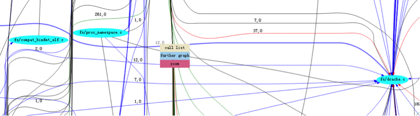

图1-12 further graph 调用关系线下拉栏效果图

由于调用关系非常复杂，调用关系图往往很大，调用关系线往往很多，此时利用左上方的菜单按钮 ，可以只保留分析人员想要的调用关系线部分，是调用关系图更加直观，效果如图1-13所示：

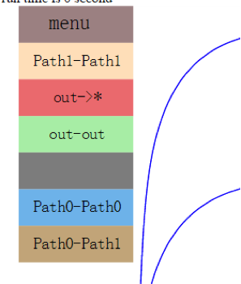

图1-13 菜单选项栏效果图

点击其他颜色按钮，只保留蓝色内部调用关系线的效果，如图1-14所示：

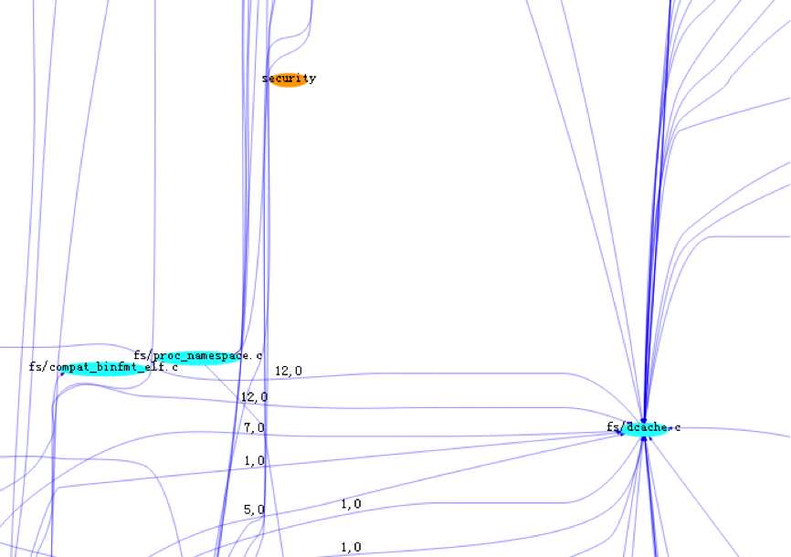

图1-14 筛选调用关系线效果图

## 2.10	
点击fs/dcache.c ，同样会弹出下拉栏选项，若点击further graph 同样会进入下一层级调用关系图，这里就不再过多介绍。点击zoom按钮，会直接进入最底层层级的调用关系图，效果如图1-15所示：

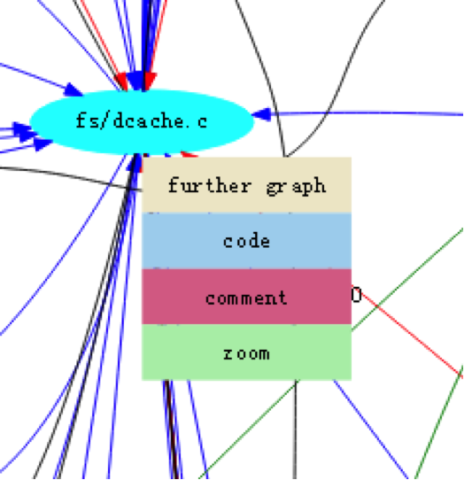

图1-15 further graph 节点下拉选项栏效果图

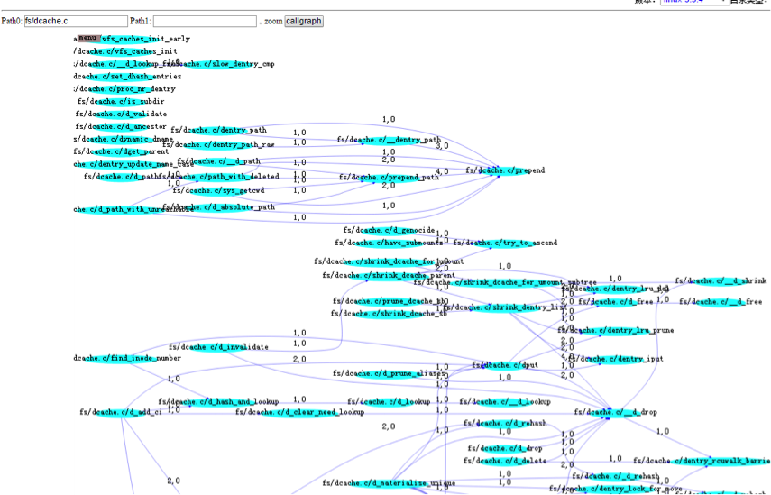

图1-16 zoom 调用关系图
