## 2.1  点击界面最右侧下拉框中“Diffe”按钮进入 Diffe模块，效果如图3-1所示：

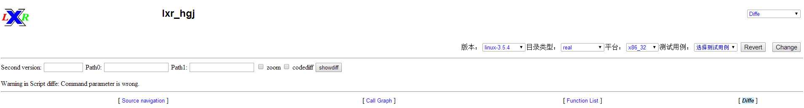

图3-1 Diffe 模块首页

## 2.2	设置函数调用图功能参数
进入 Diffe模块后，在界面中间及右侧的选项栏中，用户可以选择分析平台的系统参数，可选项分别是系统版本、目录类型和平台（即系统位数）。本手册中我们以系统版本Linux3.8.13，真实目录real，系统位数x86_32为例，依次做出选择，并点击右侧“Change”按钮，如图3-2所示：



图3-2 系统参数选项栏

## 2.3	设置函数调用分析目录范围
在系统左侧的文本框中，用户可以选择要进行比较的系统版本及当次分析的目录范围。本次说明我们以比较系统版本Linux3.5.4，目录范围mm模块为例，如图3-3所示：

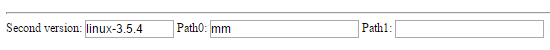

图3-3 系统比较范围输入栏

## 2.4	关系变化
2.4在选择好所要分析的参数后，点击文本框旁的“showdiff”按钮，即可生成Linux3.8.13系统对比Linux3.5.4系统的mm模块的变化情况，同样将以调用关系图的形式呈现出来，如图3-4所示：
 
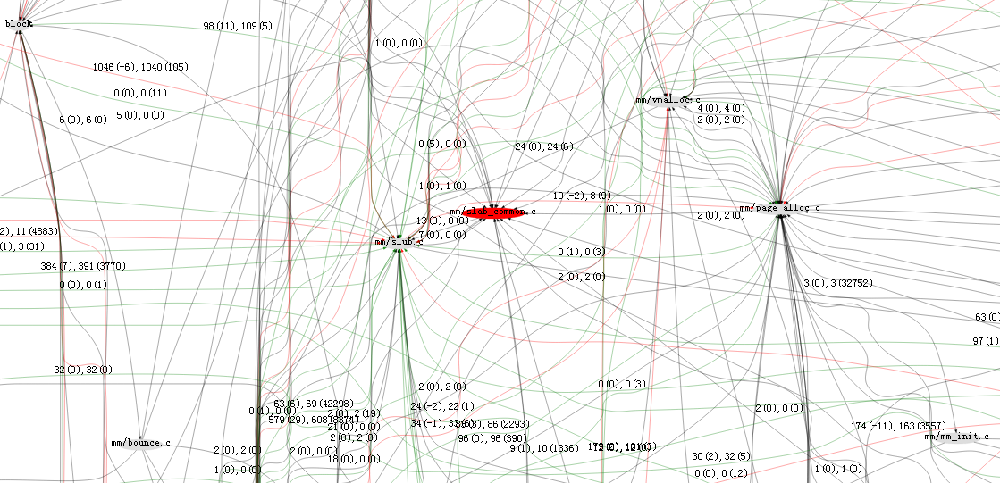

图3-4 Diffe 调用关系变化图

## 2.5	信息变化效果

此时调用关系图中的节点即为mm模块内部文件或外部其他模块，节点中的连线表示两个节点之间存在调用关系。当用户将鼠标悬放在节点上时，会出现节点修改的信息统计，包括增添内容数，删减内容数，以及修改比例。如图3-5所示：

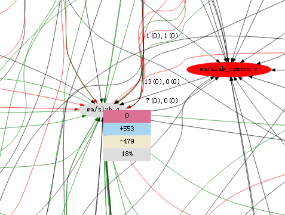

图3-5 文件信息变化效果图

表示mm/slub.c 文件新增了553行，删减了479行，修改比例为18%。

## 2.6	增删文件信息变化效果

调用关系图中除了灰色的节点外，还会有红色和绿色的节点，分别表示新版本中不再存在的节点，以及新版本中新增加的节点。查看这些节点的修改信息，如图3-6所示：

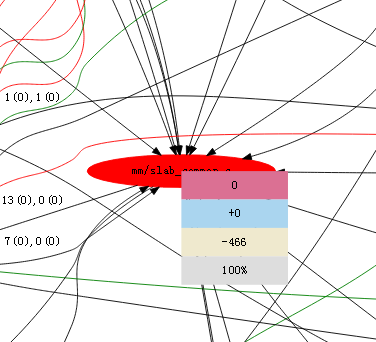

图3-6 删除文件信息变化效果图

表示mm/slab_common.c 文件在Linux3.8.13中不在存在，466行代码全部删减。

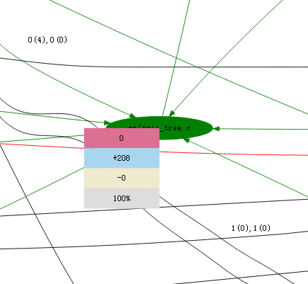

图3-7 新增文件信息变化效果图

表示mm/prio_tree.c 文件为Linux3.8.13中新添加的文件，共有208行代码。

## 2.7	Diffe 调用关系线信息变化效果

与节点的颜色含义略有区别，调用关系线的颜色也表示了调用关系的修改情况，绿色代表调用次数（静态调用）净增加的调用关系，红色代表调用次数（静态调用）净减少的调用关系，灰色表示调用次数（静态调用）不变。而调用次数的数量变化会在调用关系线上的数字中进行说明，如图3-8所示：

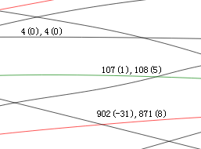

图3-8 Diffe 调用关系线信息变化效果图

逗号前的数字表示静态调用次数，逗号后的数字表示动态调用次数，括号里的数字表示调用次数的增加或减少量。

## 2.8	节点文件下拉栏选项效果

与Call Graph模块类似，点击调用关系图中的节点，会弹出下拉栏选项，如图3-9所示：

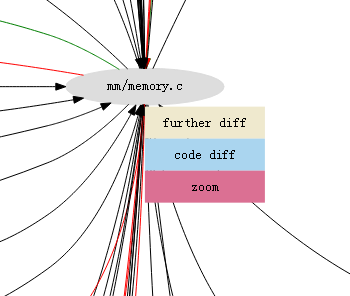

图3-9 节点文件下拉栏选项效果图

下拉栏选项中，further diff表示进入下一层级展示系统变化情况，code diff表示查看该文件的代码变化情况，zoom表示直接进入最底层级（函数级）查看变化情况。

点击code diff的效果，表格中展示文件的路径，减少行，增加行信息。如图3-10所示：

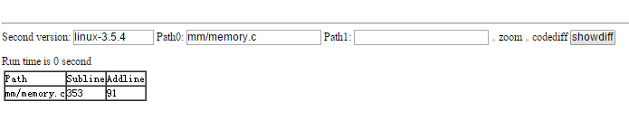

图3-10 文件代码变化列表效果图

点击zoom的效果，展示了函数级别的调用关系图及修改情况。如图3-11所示：

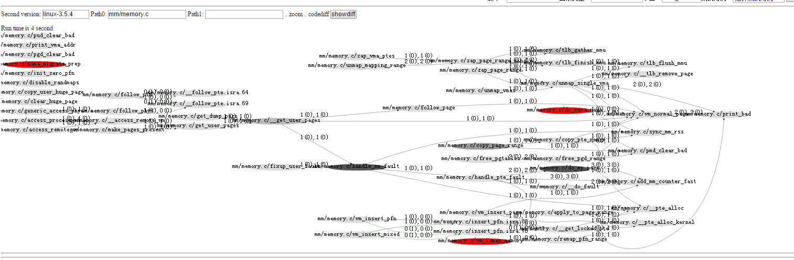

图3-11 zoom 调用关系变化图

## 2.9	调用关系线下拉栏选项

与Call Graph模块类似，在点击指定的调用关系线时，同样会弹出下拉栏选项，如图3-12所示：

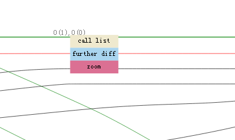

图3-12 调用关系线下拉栏选项效果图

选项栏中的内容与点击节点弹出的选项栏类似，call list会显示指定两个节点间的调用关系列表（同Call Graph模块），further diff会显示指定两个节点间的下一层级调用关系图，zoom会显示指定两个节点间的最低层级调用关系图及变化情况。

至此，整个Diff模块已介绍完毕。
