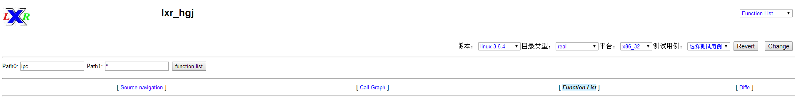
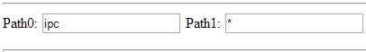
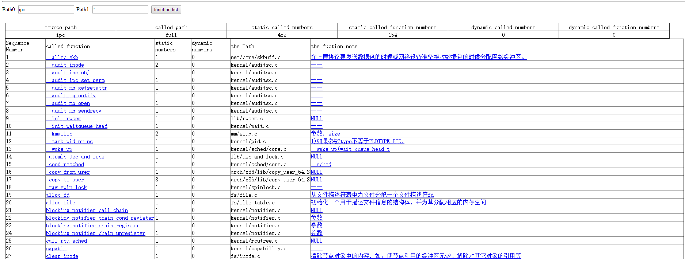

## 2.1	点击界面最右侧下拉框中“Function List”按钮，进入Function List模块，效果如图2-1所示：



图2-1 Function List模块首页

## 2.2	设置函数调用图功能参数
进入Function List模块后，在界面中间及右侧的选项栏中，用户可以选择分析平台的系统参数，可选项分别是系统版本、目录类型和平台（即系统位数）。本手册中我们以系统版本Linux-3.5.4，真实目录real，64位系统x86_64为例，依次做出选择，并点击右侧“Change”按钮，如图2-2所示：



图2-2 Function List系统参数选项栏

## 2.3	设置函数调用分析目录范围
在系统左侧的文本框中，以用户选择目录“ipc”和“*”，即ipc与全部目录为例进行功能描述，如图2-3所示：



图2-3 Function List 目录范围输入栏

## 2.4	生成函数调用列表
2.4在选择好所要分析的参数后，点击目录范围右侧的“Function List”按钮，即可生成Linux3.5.4在对应范围内的调用关系列表，效果如图2-4所示：



图2-4 Function List 调用关系列表效果图

执行到此处，我们会发现与点击call list按钮效果相同，其相应列表项各参数含义也是相同的，参照第一部分call list部分对应实现即可理解Function List模块的功能。
